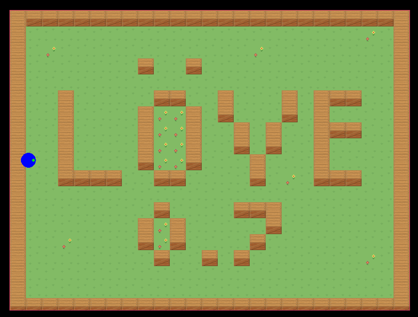

# Asteroids

<div align="center">

</div>

This uses the LOVE lua framework, to make a asteroids clone.

To run, download LOVE, and run, in the directory:

```Code
love .
```


# Controls

| KEYS          | ACTIONS |
|---------------|---|
| w             | move forward |
| r/s           | move backwards/use nitro |
| h/left arrow  | move left |
| l/right arrow | move right |


# Sources

[simple game tutorials](https://simplegametutorials.github.io/love/)

[love tile tutorial](https://github.com/kikito/love-tile-tutorial)
